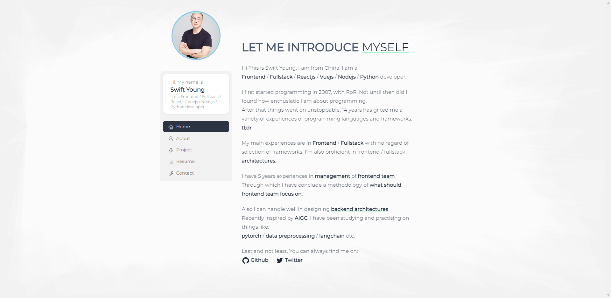

```markdown
# Personal Website Portfolio

This is my Personal Website Portfolio built using Next.js. This project showcases my personal projects and skills.



## Features

- Responsive design that works across various devices and screen sizes.
- Displays my personal information, skills, projects, and contact details.

## Tech Stack

- [Next.js](https://nextjs.org/) - React framework for server-rendered React applications.
- [React](https://reactjs.org/) - JavaScript library for building user interfaces.
- [daisyui](https://daisyui.com/) - Used for CSS styles.
- [Github API](https://www.markdownguide.org/) - Used for retrieving github data stats.

## How to Run

1. Clone this repository to your local machine:

   ```bash
   git clone https://github.com/swearer23/portfolio.git
   ```

2. Navigate to the project directory:

   ```bash
   cd portfolio
   ```

3. Install dependencies:

   ```bash
   pnpm install
   ```

4. Start the development server:

   ```bash
   pnpm run dev
   ```

5. Open your web browser and visit `http://localhost:5000` to view your personal website.


## Contact Me

- Personal Website: [https://portfolio.zspxy.xyz](https://portfolio.zspxy.xyz)
- GitHub: [https://github.com/swearer23](https://github.com/swearer23)
- Email: swearer23@gmail.com

## License

This project is licensed under the [MIT License](LICENSE).
```
